# 1. Cloud Hackathon FastAPI

In this hackathon we will get familiar with FastAPI and perform the following steps:

1. Host our first simple FastAPI locally using uvicorn.
2. Create a FastAPI serving data from a PostgresSQL Database.
3. Host the FastAPI on Azure as a Web App.
4.  Optional: Add extra functionality to the API.

In this description you will find the following

- [1. Cloud Hackathon FastAPI](#1-cloud-hackathon-fastapi)
- [2. Setup and installation](#2-setup-and-installation)
  - [2.1. Getting set up before the hackathon](#21-getting-set-up-before-the-hackathon)
    - [2.1.1. Installing Python 3 (optional but recommended)](#211-installing-python-3-optional-but-recommended)
    - [2.1.2. Installing git](#212-installing-git)
  - [2.2. Fork & Clone the FastApiHackathon repository](#22-fork--clone-the-fastapihackathon-repository)
  - [2.3. Create a virtual environment](#23-create-a-virtual-environment)
  - [2.4. Install all required python packages in the virutal environment](#24-install-all-required-python-packages-in-the-virutal-environment)
- [3. Host your first FastAPI locally](#3-host-your-first-fastapi-locally)
- [4. Host the simple FastAPI on Azure as a Web App](#4-host-the-simple-fastapi-on-azure-as-a-web-app)
  - [4.1. Create a Web App](#41-create-a-web-app)
  - [4.2. Deploy your API as a Web App](#42-deploy-your-api-as-a-web-app)
- [5 FastAPI - Customer prediction scores](#5-fastapi---customer-prediction-scores)
  - [Tasks](#tasks)

# 2. Setup and installation

## 2.1. Getting set up before the hackathon
Before the hackathon you should have the following installed on your computer. How to install each component is described below.
- Python 3 ([Windows guide](https://phoenixnap.com/kb/how-to-install-python-3-windows), [Mac guide](https://docs.python-guide.org/starting/install3/osx/)) 
- [Git](https://git-scm.com/downloads)
- Create an account on github if you do not already have one

Optional
- [Install Visual Studio Code](https://code.visualstudio.com/download)
- [Create free azure account](https://azure.microsoft.com/en-us/free/)

### 2.1.1. Installing Python 3
It is recommended to have Python 3 installed on your computer before the hackathon. This will allow you to test the application on your own computer before we deploy it to the cloud.

You can install Python 3 by following [this guide for Windows](https://phoenixnap.com/kb/how-to-install-python-3-windows) or [this guide for Mac](https://docs.python-guide.org/starting/install3/osx/). Make sure that you also install pip, a package installer for Python (this is included in both guides).

You can verify that your Python and pip installation worked by running the below commands in a terminal/command prompt window

    # Verify python
    $ python --version

    # Verify pip
    $ pip --version
### 2.1.2. Installing git 
Git can be installed [here](https://git-scm.com/downloads). In this lab we will be cloning a repository from GitHub, you do not need a GitHub account in order to do this. If you do however want to start using GitHub as well, check out [this introduction to git and GitHub](https://product.hubspot.com/blog/git-and-github-tutorial-for-beginners).

You can verify that the git installation worked by running the below command in your terminal.
    
    # Check git installation
    $ git --version

## 2.2. Fork & Clone the FastApiHackathon repository 

Go to [FastAPI Hackathon repo ](https://github.com/marius-reed/fastapihackathon) on github and fork it into your own account:

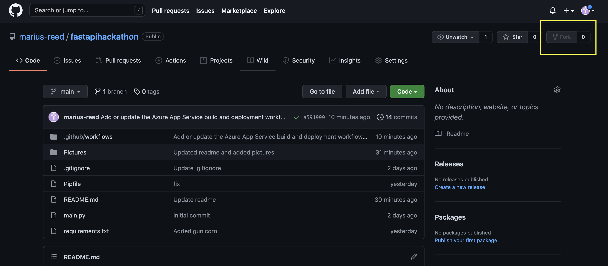

After you have completed it clone the repo from your own account:
```
git clone https://github.com/{your-account-name}/fastapihackathon.git
```

## 2.3. Create a virtual environment

This is not mandatory, but a good practice to create a virual enviroment where the python packages can be installed to avoid conflicts with other versions.
```
virtualenv .venv
```

## 2.4. Install all required python packages in the virutal environment
Install all required python packages from the requirements.txt file in the located in the repository.

```
pip install -r requirements.txt
```

# 3. Host your first FastAPI locally

In the repository there is a file called main.py where a very simple FastAPI is defined. To run this API locally on your computer run the following command:

```
uvicorn main:app
```

This will result in the following response.
```
INFO:     Started server process [10721]
INFO:     Waiting for application startup.
INFO:     Application startup complete.
INFO:     Uvicorn running on http://127.0.0.1:8000 (Press CTRL+C to quit)
```

Navigate to the URL in your preferred browser:

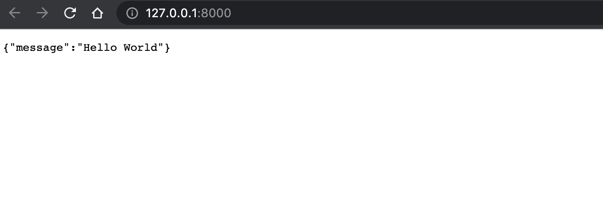

You have now hosted your first API! 

# 4. Host the simple FastAPI on Azure as a Web App
When you run the API locally it is not possible for others to reach it. Therefore we will now host our API on Azure as using a resource called Web App.

## 4.1. Create a Web App

1. Go to the [Azure Portal](portal.azure.com) and navigate to Create Resource.

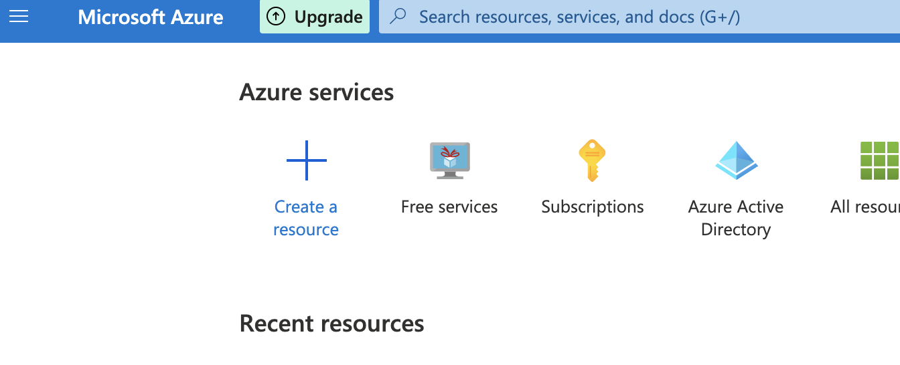

2. Find the Web App a click on "Create"
   
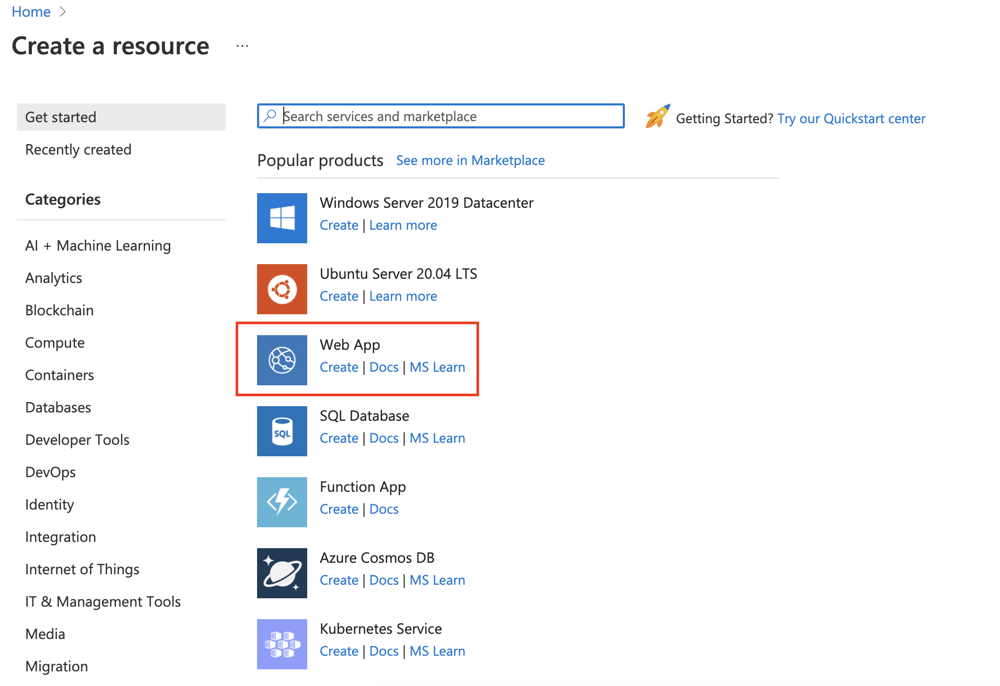

3. Fill out the basic information for creating a web app
   
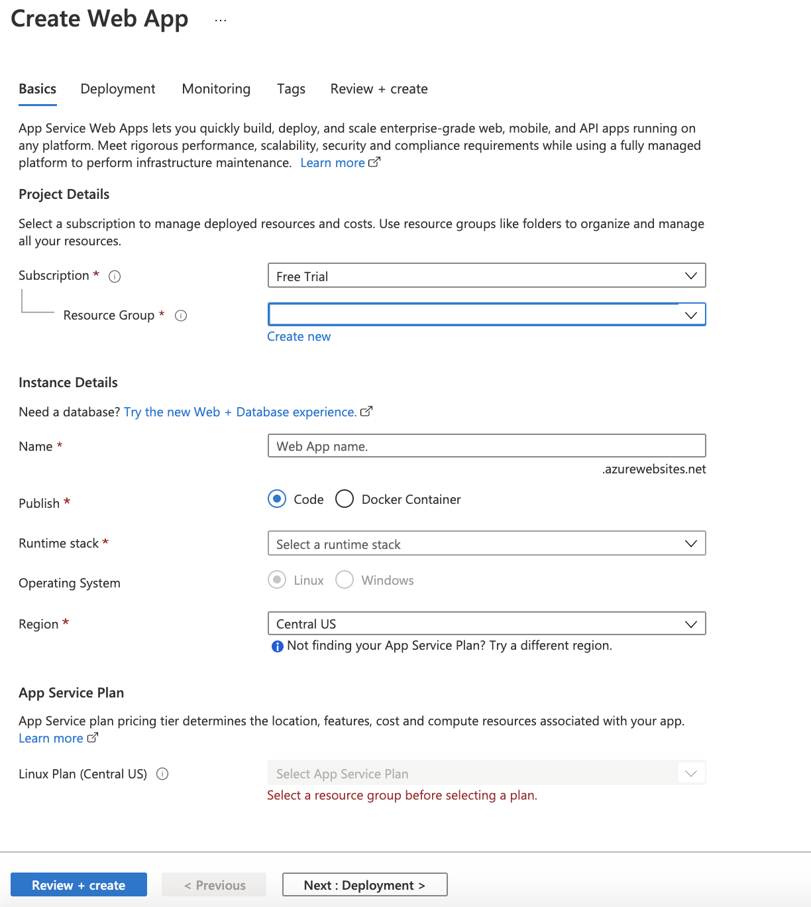

- Chose your Subscription and Resource Group in the drop down menu
- *Name*: Give your web app a name (eg. {your-initials}-wapp-helloworldapi01)
- *Publish*: Code
- *Runtime Stack*: Python 3.8
- *Region*: West Europe
- *Linux Plan*: Click "Create New" and give a suitable name (eg. {your-initials}-asp-hackathon01)

Click on Review + Create.

If everything is validated click on Create. The web app will now be deployed. This will take a minute or two.
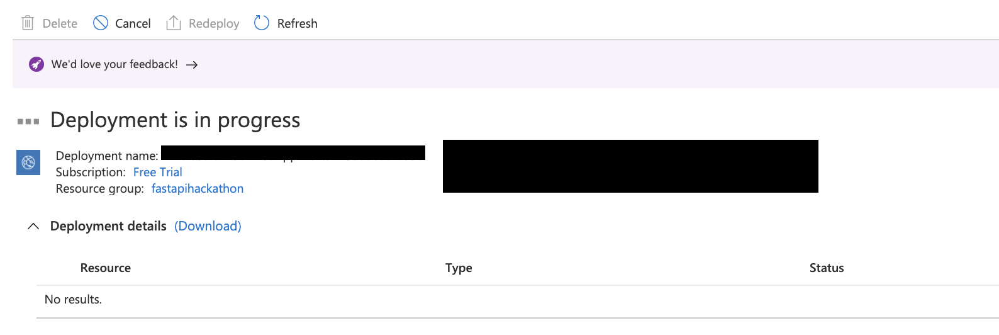

## 4.2. Deploy your API as a Web App

When your Web App is deployed click on Go to resource.
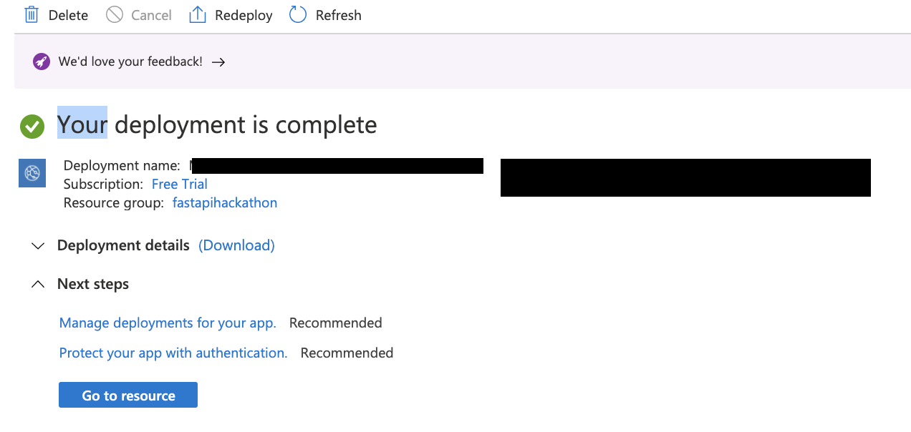

When you get to the landing page, go to deployment Center
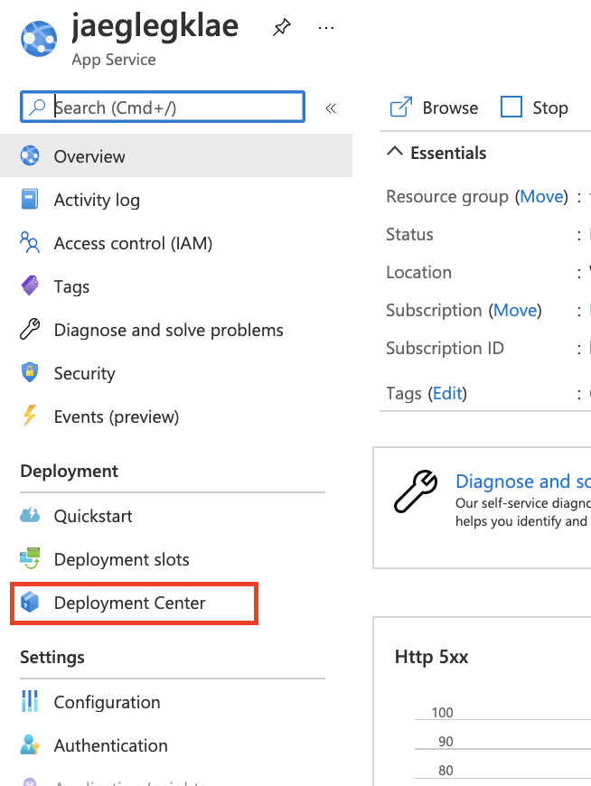

Chose the following:
- *Source*: GitHub
- Click on Change provider and chose App Service Build Service
- Sign in to Github and chose your account
- *Organization*: Your GitHub username
- *Repository*: fastapihackathon
- *Branch*: main

It should look something like this. Click on Save.
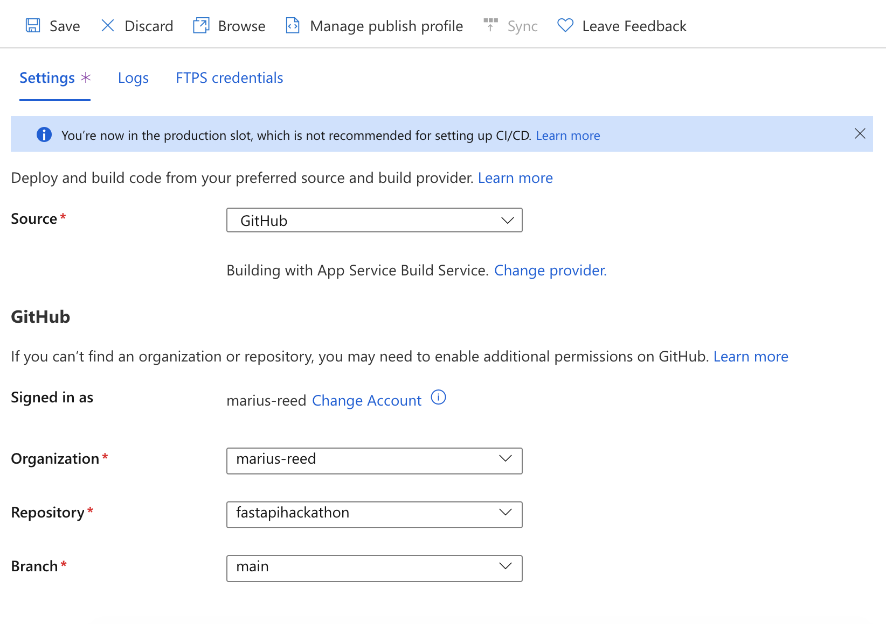

Go to **Configuration** under Settings on the left side, and then to **General Settings**. Set Startup command to 

```
gunicorn -w 4 -k uvicorn.workers.UvicornWorker main:app
```

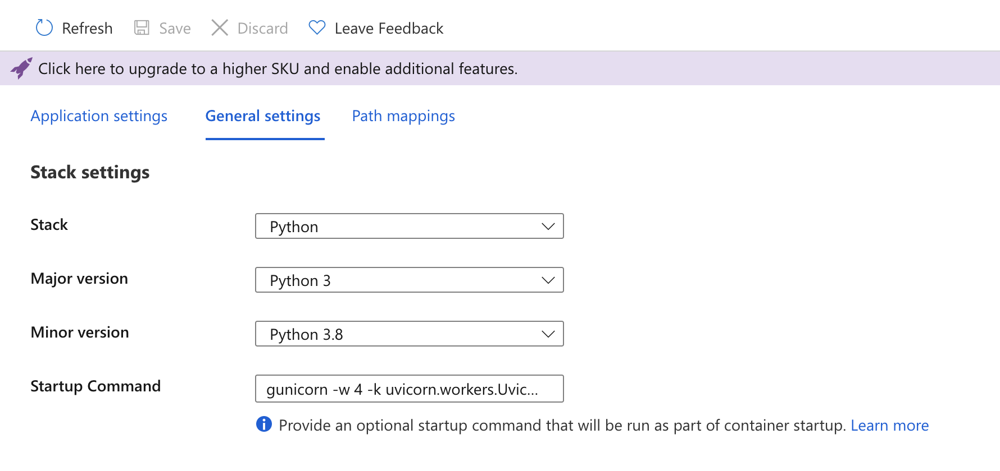

Go back to deployment center and click on **Browse**. You should now see the response from your API.

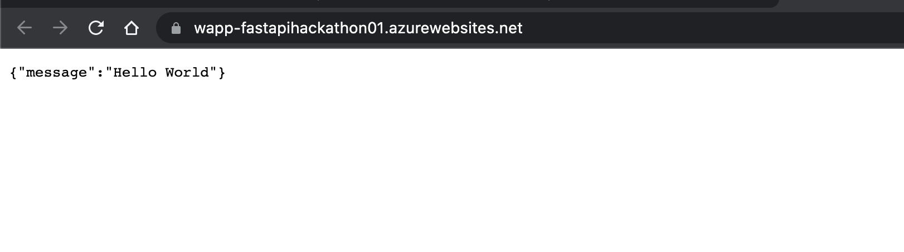

If you go to /docs behind the url you will get the Swagger documentation of your API where you can test all the endpoints (now we only have one).

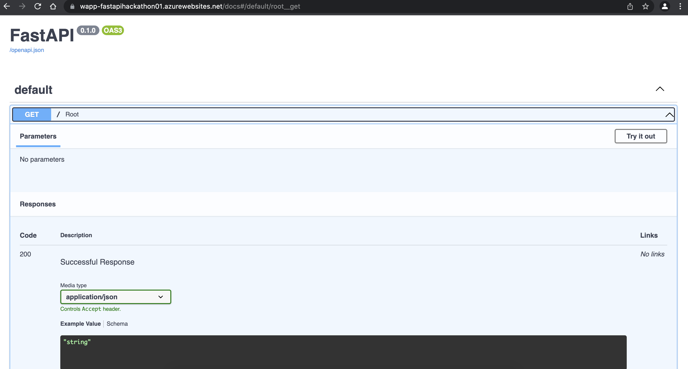

# 5 FastAPI - Customer prediction scores

In the git repo there is another FastAPI called *partII.py*. The API is used to make scores from prediction models available.

This API is connected to a PostgresSQL database with a table called **fastapihackathon.CustomerScore** with the following definition:

```
CREATE TABLE fastapihackathon.CustomerScore (
   customer_model_id integer not null,
   customer_id integer not null,
   model_id integer not null,
   model_name varchar(50) not null,
   score float not null,
   updated_date date not null,
   has_churned BOOLEAN
);
```

There are currently customer_id's in the range 10000-10100 and (model_id, model_name) IN [(100,churn_30d), (101,upgrade_subscription_30d), (102,downgrade_subscription_30d)].

## Tasks
- Host the API in partII.py locally.
- Change your Web App to host the partII-API instead of the simple "Hello World"-API.
- Test the different endpoints from the swagger interface
- Extend functionality for the API:
  -  Endpoint to request the Upgrade score for a given customer
  -  Endpoint to request the Downgrade score for a given customer
  -  Endpoint to request all available scores for a given customer
  -  Endpoint to return top X customers with highest score from a prediction model.

  
   
